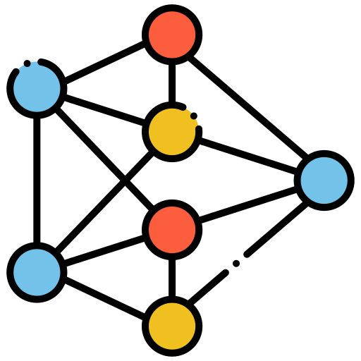

<div align="center">  
  <p>
    
  </p>
  <h2>RECOMENDA.AI</h2>
  <p>
    <span>Modelo inteligente de recomendação de conteúdo.</span>
    <br/>
    <br/>
    <a href="/modelos/"><strong>Explorar source code</strong></a>
    <br/>
    <br/>
    <span>Bem-vindo ao <b>recomenda.ai</b><span>
    <br/>
  </p>
  
  <details>      
  <summary><b>Sumário</b></summary>

  [Sobre o Projeto](#sobre)

  [Dataset](#dataset)

  [Design](#design)

  [Pipeline](#pipeline)

  [Artefatos](#artefatos)

  [Instalar & Executar](#instalar)

  [Desenvolvido Com](#desenvolvidocom)

  [Desenvolvido Por](#desenvolvidopor)

  [Fontes](#fontes)

  </details>
  <br/>
</div>

# Sobre o Projeto
<div align="center" id="sobre">

![Product Name ScreenShot][product-screenshot] 

</div>

<div>
  <span>
    Sua empresa foi contrada pela Netflix para construir o novo sistema de recomendação da plataforma de streaming mais famosa do mundo.
    A área de negócio responsável na Netflix fez algumas observações na reunião de Kick-Off que deverão ser consideradas durante o processo:
  </span> 

  <br/>  
  <b>Considerações:</b>

  * A recomendação deve ocorrer de duas formas. 
    * [x] A primeira deve ser uma recomendação baseada no histórico do usuário.

      - [item_based_collaborative_filtering](/modelos/item_based_collaborative_filtering/)

    * [x] A segunda deve ser uma recomendação baseada no perfil pessoal do usuário.

      - [content_based_filtering](/modelos/content_based_filtering/)


  <br/>
  <b>Exigências:</b>

  * [x] O desenvolvimento deve ser feito em Python (versão 3.8 ou superior)
  * [ ] O ambiente de desenvolvimento deve ser capaz de ser reproduzido a qualquer momento.
  * [x] O dataset será fornecido pela Netflix.
  * [x] Sua equipe deverá fornecer insigths relevantes sobre a base de dados:
    * Estes insights também serão utilizados pela Netflix para melhorar seu processo de Engenharia de Dados. 
    * Para seu time, os insights serão os guias no desenho dos modelos de recomendação.
  * [ ] Deverão ser criados pelo menos 2 modelos com abordagens diferentes.
    * [ ] MODELO X
    * [ ] MODELO Y
  * [ ] Todas as decisões de modelagem, definição de hyper parametros e etc devem ser documentadas e justificadas do porque da utilização.
  * [ ] Deverá ser apresentado relatório completo do desempenho dos modelos treinados, considerando métricas relevantes para a análise destes desempenhos.
  * [ ] A equipe deverá criar um pipeline teórico de deploy completo do projeto em alguma plataforma de núvem (ex: Google Cloud Platform, AWS, Microsoft Azure).
  * [x] O Projeto deverá ser publicado em repositório GIT.
  <br/>
</div>

# Dataset
<div id="dataset">

  O [dataset](/dataset/) fornecido pela Netflix contem informações relevantes e está dividido em:
  - [movies](/dataset/movies.csv)
  - [ratings](/dataset/ratings.csv)
  
  onde, movies contem informações relevantes sobre o filme sendo título e gênero, e ratings contendo informações referente a avaliações das obras.

  Para além dos insights fornecidos abaixo, o dataset pode ser considerado coerente. Apesar de não ser tão completo e abrangente, podemos afirmar que os dados são precisos, consistentes, padronizado tendo como resultado pouco esforço necessário no pré-processamento dos dados.

  <br/>

  ### Insights

  Sugestões de melhoria detectados durante a preparção dos dados:
  * Movies:
    - <b>Titulo e Ano na mesma coluna:</b>
        
        No dataset, o titulo da obra e o ano estão na mesma coluna, separadas por parênteses como por exemplo:
        ````
        Bushwhacked (1995)
        ````
        Separar o titulo e o ano em colunas especificas ajuda a manter a consistência da base, melhora o processo de preparação dos dados retirando a necessidade de tratar o campo titulo/ano, e pode também ajudar na performance dos demais serviços da companhia que consomem esse dado.

        Considerando ainda que existem títulos onde há parênteses no nome, como por exemplo:

        ````
        Eat Drink Man Woman (Yin shi nan nu) (1994)
        ````

        A separação desses dados se torna ainda mais crucial, evitando que títulos sejam deformados caso a única validação nos pré processamentos seja ignorar dados entre parenteses.

    - <b>Padronização na nomenclatura dos gêneros:</b>

        Os filmes com gêneros relacionados a Ficção Científica (Science Fiction) e Filme Negro (Noir) são os únicos gêneros abreviados com o simbolo - na base:
        ````
        Sci-Fi | Film-Noir
        ````
        Por fugirem do padrão e com o objetivo de simplificar a análise e garantir consistência nos dados, a sugestão seria que as nomenclaturas fossem:
        ````
        SciFi | Noir
        ````
    - <b>Gêneros ausentes:</b>

        Quando um filme não possúi o gênero descrito, na base a coluna gênero recebe o termo:
        ````
        (no genres listed)
        ````
        O ideal, seria deixar a coluna nula. A validação por nulo é bem mais simples e é uma rotina padrão na análise de dados, facilitando a validação nos serviços que consomem esse dado, e também o pré-processamento descartando a necessidade de procurar por um termo específico.

    - <b>Ausência de dados gerais:</b>
      Em sistemas de streaming, comummente os usuários podem configurar/tender (a) certas preferências que podem incluir:
      
        - Classificação indicativa
        - Elenco
        - Duração
        - País de origem

      Essas informações inrrequiceriam a análise de dados e resultaria em recomendações mais acuradas e precisas, porém, são informações que não estão disponíveis nas bases fornecidas.
    
    Não foram identificados pontos de melhorias significantes na base ratings.

  <br/>
</div>


# Design
<div id="design">

  * Falar sobre decisões de modelagem, definição de hyper parametros e etc.
  * Falar sobre os modelos escolhidos, ambos X e Y, e justificar o porque.

  <br/>
</div>

# Pipeline
<div id="pipeline">

  * Explicar e exemplificar o pipeline.


  <br/>
<div/>

# Artefatos
<div id="artefatos">

  * Doc sobre os insights.
  * Doc sobre os design.
  * Doc sobre decisões de modelagem, definição de hyper parametros e etc.
  * Doc sobre desempenho dos modelos treinados, considerando métricas relevantes para a análise.
  * Doc sobre pipeline teórico de deploy.

  <br/>
</div>

# Instalar & Executar
<div id="instalar">

  * Falar sobre a utilização/configuração do docker e como rodar o projeto local.

  </br>

</div>


# Desenvolvido Com
<div id="desenvolvidocom">

  Listar as principais linguagens e frameworks utilizados no desenvolvimento.

  [![Python][Python]][Python-url]

  <br/>
</div>

# Considerações Finais
<div id="desenvolvidopor">

  Trabalho desenvolvido por: Thales Cristian & Neuber Tavares
</br>
  <span>
  Projeto referente a Unidade Curricular(UC) de Inteligência Artificial (UNIBH-2023/2), proposto pelo professor Marco Calijorne como avaliação final.
  </span>


  <a href="https://www.linkedin.com/in/chalestristian/"></a>
  <a href="mailto:thales.cristianeugenio@gmail.com?subject=Contact From Github"></a>
  <br>
</div>

# Fontes
<div id="fontes">

  Fontes de pesquisas utilizados.
  * [GitHub Pages](https://pages.github.com)
  <br/>
</div>


<!-- MARKDOWN LINKS & IMAGES -->
[product-screenshot]: readme_img/screenshot.png
[Python]: https://img.shields.io/badge/Python-000000?style=for-the-badge&logo=python&logoColor=white
[Python-url]: https://www.python.org/